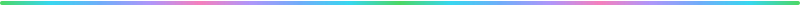
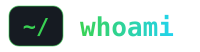
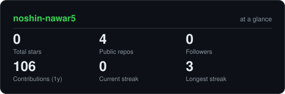
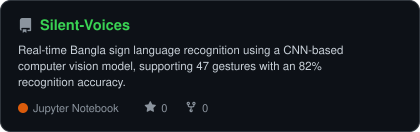
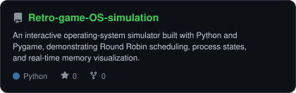
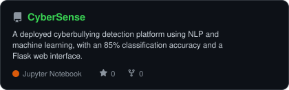

<div align="center">

<br>
<a href="https://github.com/noshin-nawar5">
  
</a>
<br>
<a href="https://linkedin.com/in/noshin-nawar5/"></a><a href="mailto:noshinalavee5@gmail.com"></a><a href="https://portfolio-flame-sigma-34.vercel.app/"></a>

<br>
    
</div>


```console
$ cat about.txt
```
Hi, I'm Noshin Nawar, a Computer Science & Engineering student at North South University who enjoys turning ideas into working software.
My projects have taken me across machine learning, computer vision, NLP, web development, and systems programming — from recognizing Bangla sign language gestures to building an interactive operating-system simulator.
🎓 Studying Computer Science & Engineering at North South University.
🧠 Interested in machine learning, computer vision, intelligent applications, and software engineering.
🛠️ I enjoy building projects end-to-end — from data collection and model training to backend development and deployment.
🔬 Currently working on Koi Pabo / StyleSearch BD, an image-based fashion search system designed around the Bangladeshi market.
💻 Comfortable moving between Python, web development, APIs, databases, and systems programming.
🚀 Currently focused on building stronger real-world software and ML projects.
✨ Fun fact: I started building because I kept wishing certain things already existed.
<br>
<div align="center">


</div>

<div align="center">

<table>
<tr>
<td width="50%" align="center" valign="middle">
<picture>
  <source media="(prefers-color-scheme: dark)" srcset="assets/radar-dark.svg">
  <source media="(prefers-color-scheme: light)" srcset="assets/radar-light.svg">
  
</picture>
</td>
<td width="50%" align="center" valign="middle">
<picture>
  <source media="(prefers-color-scheme: dark)" srcset="assets/radar-langs-dark.svg">
  <source media="(prefers-color-scheme: light)" srcset="assets/radar-langs-light.svg">
  
</picture>
</td>
</tr>
</table>
</div>

<div align="center">


<br><br>
<picture>
  <source media="(prefers-color-scheme: dark)" srcset="https://raw.githubusercontent.com/noshin-nawar5/noshin-nawar5/output/snake-dark.svg">
  <source media="(prefers-color-scheme: light)" srcset="https://raw.githubusercontent.com/noshin-nawar5/noshin-nawar5/output/snake.svg">
  
</picture>
</div>

<div align="center">

<picture>
  <source media="(prefers-color-scheme: dark)" srcset="assets/card-stats-dark.svg">
  <source media="(prefers-color-scheme: light)" srcset="assets/card-stats-light.svg">
  
</picture>
<br>

<br><br>

</div>

<div align="center">

<table>
<tr>
<td width="50%">
<a href="https://github.com/noshin-nawar5/Silent-Voices">
<picture>
  <source media="(prefers-color-scheme: dark)" srcset="assets/card-Silent-Voices-dark.svg">
  <source media="(prefers-color-scheme: light)" srcset="assets/card-Silent-Voices-light.svg">
  
</picture>
</a>
</td>
<td width="50%">
<a href="https://github.com/noshin-nawar5/Retro-game-OS-simulation">
<picture>
  <source media="(prefers-color-scheme: dark)" srcset="assets/card-Retro-game-OS-simulation-dark.svg">
  <source media="(prefers-color-scheme: light)" srcset="assets/card-Retro-game-OS-simulation-light.svg">
  
</picture>
</a>
</td>
</tr>
<tr>
<td width="50%">
<a href="https://github.com/noshin-nawar5/CyberSense">
<picture>
  <source media="(prefers-color-scheme: dark)" srcset="assets/card-CyberSense-dark.svg">
  <source media="(prefers-color-scheme: light)" srcset="assets/card-CyberSense-light.svg">
  
</picture>
</a>
</td>
<td width="50%" align="center">
More projects coming soon.
<br><br>
I build across machine learning, software engineering, web development, and systems programming.
</td>
</tr>
</table>
<sub>

project	description	stack
Silent Voices	Bangla sign-language recognition and translation system	   
RetroCore OS	Interactive operating-system simulator with process scheduling and memory visualization	  
CyberSense	Cyberbullying detection platform with NLP classification and user-support chatbot	   
</sub>
</div>

<div align="center">
<sub>`01110100 01101000 01100001 01101110 01101011 01110011 00100000 01100110 01101111 01110010 00100000 01110011 01100011 01110010 01101111 01101100 01101100 01101001 01101110 01100111`</sub>
</div>